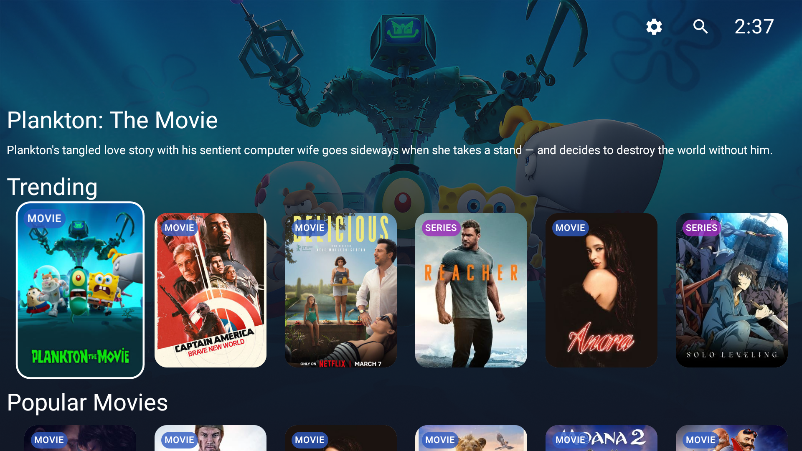
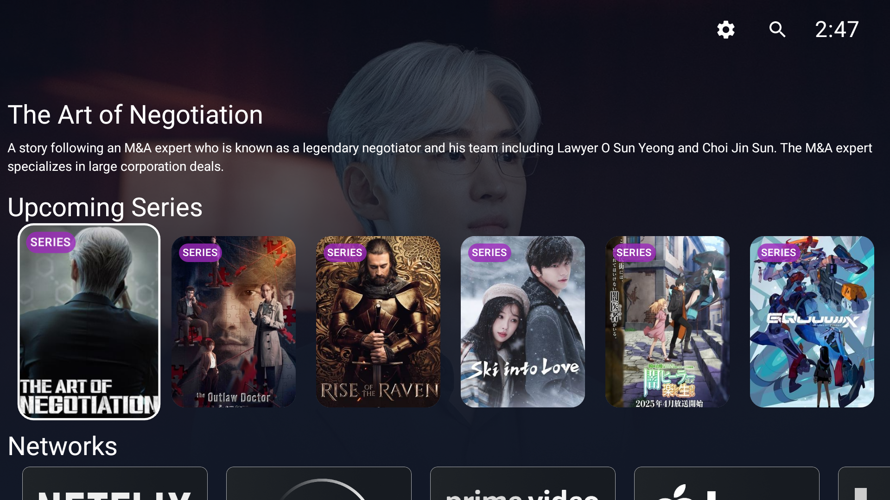

# SeerrTV

[](https://cursor.com)


[](https://discord.gg/nTFk3jHbk5)

SeerrTV is an Android TV application that provides a comprehensive media browsing and request management interface for Seerr, Jellyseerr and, Overseerr media request systems. It enables users to browse, search, request, and monitor the status of media requests directly from their Android TV device.

## Screenshots

<div align="center">
  
  <p><em>Main browsing interface</em></p>
  
  
  <p><em>Detailed media information</em></p>
  
  
  <p><em>Search functionality</em></p>
  
  
  <p><em>Advanced filtering options</em></p>
  
  
  <p><em>Request management interface</em></p>
</div>

## Features

### Media Browsing & Discovery
- **Unified Browse Screens** - Dedicated Movies and Series browse screens with grid-based layout optimized for Android TV
- **Advanced Filtering System** - Comprehensive filtering with 13+ filter categories:
  - Release Date / First Air Date (date range)
  - Genres (multi-select with search)
  - Keywords (searchable multi-select)
  - Original Language (single selection)
  - Content Rating (multi-select with region support)
  - Runtime, User Score, Vote Count (range filters)
  - Studios (Movies only - searchable)
  - Networks (TV only - searchable multi-select)
  - Streaming Services (multi-select with region support)
- **Sort Menu** - Sort by Popularity, Release Date, First Air Date, TMDB Rating, or Title (A→Z / Z→A) with bidirectional sorting
- **Enhanced Search** - Real-time search with D-pad optimized navigation, inline results, and state preservation
- **Category Browsing** - Browse by categories (Recently Added, Recent Requests, Trending, Popular Movies, Movie Genres, etc.)
- **Detailed Media Information** - Cast, crew, ratings, and related content
- **Dynamic Backdrop System** - Cycling backdrop images with gradient overlays
- **Person Information** - Filmography browsing with biographical information
- **Category Exploration** - Browse by genres, studios, and networks with dedicated discovery screens
- **Infinite Scroll Pagination** - Automatic loading of additional results as you browse
- **State Preservation** - Grid position, selection, filters, and sort preferences preserved during navigation

### Request Management
- **Movie & TV Requests** - Request movies and TV shows with configurable options
- **Tag Support** - Organize requests with server-specific tags (multi-select)
- **Sonarr Lookup** - Interactive series matching when TVDB ID is missing (with poster images and D-pad navigation)
- **HD/4K Support** - Separate request options for HD and 4K quality tiers
- **Server Selection** - Choose from multiple Radarr/Sonarr servers when configured
- **Quality Profile Selection** - Select from configured quality profiles
- **Root Folder Selection** - Choose root folder for TV show requests (when enabled)
- **Season Selection** - Multi-select season picker for TV series
- **Real-time Status Monitoring** - Monitor request status and download progress with automatic refresh
- **Permission-Based Actions** - Support for different user permission levels (admin vs. regular user)
- **Request Approval Workflow** - Administrators can approve/decline pending requests
- **Request Deletion** - Delete requests and media files (based on permissions)
- **Media Status Indicators** - Visual status icons including deleted and blacklisted states

### Issue Reporting & Management
- **Permission-Based Access** - Issue functionality controlled by VIEW_ISSUES and CREATE_ISSUES permissions
- **Issue Reporting** - Report media quality and playback issues directly from the app
- **Categorized Issue Types** - Video, Audio, Subtitle, and Other categories with precanned descriptions
- **Season/Episode Selection** - Select specific seasons/episodes for TV series issues
- **Custom Descriptions** - Add detailed problem descriptions beyond precanned options
- **Comment System** - Discussion and updates on issues with threaded comments
- **Issue Status Tracking** - Open and Resolved status with visual indicators
- **Issue Count Indicators** - Display number of reported issues on media details screen
- **Issue Management** - View and manage existing issues with detailed history and status updates

### Authentication & Configuration
- **Multiple Authentication Methods**:
  - API Key authentication
  - Local User authentication
  - Plex authentication with PIN code system
  - Jellyfin/Emby authentication (for Jellyseerr and Seerr)
- **Automatic Server Detection** - Detects Seerr, Overseerr, or Jellyseerr server types automatically
- **Browser-Based Setup** - QR code or URL-based configuration for easier setup
- **Manual Wizard** - Step-by-step configuration wizard with guided setup
- **Cloudflare Protection** - Bypass Cloudflare Access protection with service token authentication
- **Flexible Configuration** - Supports HTTP/HTTPS with SSL certificate validation
- **Connection Testing** - Real-time connection validation before proceeding

### TV-Optimized Interface
- **Material Design 3** - Theming optimized for TV screens with consistent styling
- **D-pad Navigation** - Comprehensive D-pad navigation with focus management throughout the app
- **Visual Feedback** - Clear focus indicators and selection state feedback
- **Slide Animations** - Smooth slide-in/out animations for modals, drawers, and menus
- **Auto-Scrolling** - Content automatically scrolls to keep focused items visible
- **Expandable Content** - Expandable text areas for long descriptions with "Read More/Less"
- **Smart Layout** - Dynamic layout adjustment based on content availability
- **Persistent Top Bar** - Always-visible top bar with search, settings, and clock
- **Settings Menu** - Slide-in settings panel with auto-scrolling and organized submenus

### Localization & Internationalization
- **Independent App Language** - User interface language is independent of Discovery Language
- **Language Selection** - Choose from supported languages (English, German, Spanish, French, Japanese, Dutch, Portuguese, Chinese)
- **On-the-Fly Language Change** - Switch UI language from Settings Menu without restarting
- **Automatic Migration** - Existing users automatically use system default language (if supported) or English
- **Regional Settings** - Default streaming region setting for watch providers and content ratings

### External Integration
- **Media Server Playback**:
  - Direct integration with Plex for media playback
  - Jellyfin media server support
  - Emby media server support with dual-app compatibility (Android TV and regular Android apps)
- **Trailer Viewing** - YouTube integration for trailer playback
- **Metadata Integration** - TMDb (The Movie Database) integration for ratings, cast, crew, and metadata
- **Downstream Services**:
  - Sonarr server integration for TV series management
  - Radarr server integration for movie management
  - Multi-server support for both HD and 4K quality tiers
  - Server-specific quality profiles and root folder selection

## Quick Start

### For End Users

#### Installation Options

**Option 1: Google Play Store (Recommended)**
- SeerrTV is available on [Google Play Store](https://play.google.com/store/apps) for official releases
- Automatic updates via Play Store
- Easiest installation method

**Option 2: GitHub Releases (Sideload)**
- Download the latest APK from [GitHub Releases](https://github.com/devmesh-git/seerrtv/releases)
- Enable "Install from Unknown Sources" on your Android TV device
- Transfer the APK to your device and install
- The app automatically checks for updates from GitHub Releases when opened
- See [FAQ](#faq--troubleshooting) for detailed sideloading instructions

#### Basic Configuration

1. **Launch SeerrTV** on your Android TV device
2. **Choose configuration method**:
   - Browser-based setup (QR code or URL) - Recommended for easier setup
   - Manual step-by-step wizard
3. **Configure server connection**:
   - Enter protocol (HTTP/HTTPS)
   - Set hostname or IP address
   - Select authentication method (API Key, Plex, Local User, or Jellyfin/Emby)
4. **Complete authentication**:
   - Follow on-screen instructions for your chosen auth method
   - For Plex auth: Visit plex.tv/link and enter the provided PIN
   - For API key: Enter your server's API key
   - For local user: Enter username and password
5. **Start browsing!** The app will automatically detect your server type (Seerr, Overseerr, or Jellyseerr)

For detailed configuration guides, see:
- [Cloudflare Access Configuration Guide](docs/CLOUDFLARE_CONFIGURATION.md) - Setting up Cloudflare Zero Trust protection
- [App Configuration](#app-configuration) section below for more details

### For Developers

1. **Clone the repository**:
   ```bash
   git clone https://github.com/devmesh-git/seerrtv.git
   cd seerrtv
   ```

2. **Open in Android Studio**:
   - Open Android Studio
   - Select "Open an Existing Project"
   - Navigate to the cloned `seerrtv` directory
   - Android Studio will sync Gradle dependencies

3. **Build and run**:
   ```bash
   # Debug build
   ./gradlew assembleDirectDebug
   
   # Or build and install directly on connected device/emulator
   ./gradlew installDirectDebug
   ```

4. **See [Development Setup](#development-setup) below for detailed build instructions**

## Requirements

### For Users
- Android TV device (Android 5.0 / API 21 or higher recommended)
- Seerr, Overseerr, or Jellyseerr server instance
- Network access to your media server

### For Developers
- **Java Development Kit (JDK)**: Java 21 (required)
  - **macOS** (recommended): Android Studio includes Java 21 (JBR) which is automatically used via `gradle.properties`
    - Alternative: Using Homebrew: `brew install openjdk@21`
    - Or download from [Adoptium](https://adoptium.net/)
  - **Linux**: 
    - Ubuntu/Debian: `sudo apt install openjdk-21-jdk`
    - Fedora/RHEL: `sudo dnf install java-21-openjdk-devel`
    - Arch Linux: `sudo pacman -S jdk21-openjdk`
    - Or download from [Adoptium](https://adoptium.net/)
  - **Windows**: 
    - Download from [Adoptium](https://adoptium.net/)
    - Or use [Chocolatey](https://chocolatey.org/): `choco install openjdk21`
  - Verify installation: `java -version` (should show version 21)
- Android Studio Hedgehog or later
- Android SDK with API level 25-36
- Android TV emulator or physical device for testing

## Technologies Used

- **UI Framework**: Jetpack Compose for modern, declarative UI
- **Dependency Injection**: Hilt for clean architecture
- **Image Loading**: Coil for efficient image caching and loading
- **Asynchronous Operations**: Coroutines and Flow for reactive programming
- **Navigation**: Jetpack Navigation with custom transitions
- **Data Storage**: SharedPreferences for configuration
- **HTTP Client**: Ktor for API communication
- **Platform**: Android TV SDK for TV-specific features

## Development Setup

### Building for Distribution

SeerrTV supports two distribution methods with different build variants:

#### Play Store Distribution (.aab)

For Google Play Store releases, build the **play** flavor which excludes update functionality and sensitive permissions:

```bash
# Debug build for testing
# macOS/Linux:
./gradlew bundlePlayDebug
# Windows:
gradlew.bat bundlePlayDebug

# Release build for Play Store submission
# macOS/Linux:
./gradlew bundlePlayRelease
# Windows:
gradlew.bat bundlePlayRelease
```

The Play Store build:
- Contains no auto-update functionality
- Excludes `REQUEST_INSTALL_PACKAGES` permission
- Fully compliant with Play Store policies
- Generates `.aab` files for Play Console upload

#### Direct Distribution (.apk)

For sideloading and direct distribution, build the **direct** flavor which includes update functionality:

```bash
# Debug build for testing
# macOS/Linux:
./gradlew assembleDirectDebug
# Windows:
gradlew.bat assembleDirectDebug

# Release build for direct distribution
# macOS/Linux:
./gradlew assembleDirectRelease
# Windows:
gradlew.bat assembleDirectRelease
```

**Platform Notes**:
- **macOS**: Android Studio's bundled Java 21 (JBR) is automatically used via `gradle.properties`. If you don't have Android Studio, set `JAVA_HOME` environment variable to your JDK 21 installation path, or update `gradle.properties` to set `org.gradle.java.home`.
- **Linux/Windows**: Set `JAVA_HOME` environment variable to your JDK 21 installation path, or override it in `gradle.properties` by setting `org.gradle.java.home`.

The direct build:
- Includes auto-update functionality (fetches from GitHub Releases API)
- Contains `REQUEST_INSTALL_PACKAGES` permission
- Generates `.apk` files for direct installation

#### Build Variants Summary

| Variant | Output | Auto-Updates | Permissions | Use Case |
|---------|--------|--------------|-------------|----------|
| `play` | `.aab` | ❌ Disabled | Minimal | Google Play Store |
| `direct` | `.apk` | ✅ Enabled | Full | Sideloading, websites |

#### Signing Configuration

For release builds, you need to configure APK signing:

1. **Create signing properties file**:
   ```bash
   # macOS/Linux:
   cp tv/signing.properties.template tv/signing.properties
   
   # Windows (Command Prompt):
   copy tv\signing.properties.template tv\signing.properties
   
   # Windows (PowerShell):
   Copy-Item tv\signing.properties.template tv\signing.properties
   ```

2. **Edit `tv/signing.properties`** with your keystore information:
   ```properties
   storeFile=../localSigningKey.jks
   storePassword=your_keystore_password
   keyAlias=your_key_alias
   keyPassword=your_key_password
   ```

3. **Security Notes**:
   - `signing.properties` is automatically gitignored
   - Debug builds use the default debug keystore automatically
   - For CI/CD, you can use environment variables: `KEYSTORE_PASSWORD`, `KEY_ALIAS`, `KEY_PASSWORD`

For detailed signing setup instructions, see [Signing Setup Guide](docs/SIGNING_SETUP.md).

#### Configuration Files

**Browser Configuration**: The browser-based configuration endpoint can be customized by creating a `browser-config.properties` file:
- Copy `tv/browser-config.properties.template` to `tv/browser-config.properties`
- Update the `browser.config.base.url` property if needed
- Default value points to `https://seerrtv.devmesh.ca`
- This file is gitignored for security

**Release Workflow**:
1. **For Play Store**: 
   - macOS/Linux: Build with `./gradlew bundlePlayRelease`
   - Windows: Build with `gradlew.bat bundlePlayRelease`
   - Upload the generated `.aab` to Play Console
2. **For Direct Distribution**: 
   - macOS/Linux: Build with `./gradlew assembleDirectRelease`
   - Windows: Build with `gradlew.bat assembleDirectRelease`
   - Upload the generated `.apk` to a GitHub Release
   - The app automatically checks `https://api.github.com/repos/devmesh-git/seerrtv/releases/latest` for updates
   - Ensure the release tag follows semantic versioning (e.g., `v0.26.4`)

**Note**: On Windows, you can also use `./gradlew` in Git Bash, WSL, or PowerShell. The `gradlew.bat` command works in all Windows shells including Command Prompt.

Both builds share the same codebase and features - only the update mechanism and permissions differ based on the build variant.

## App Configuration

On first run, the app will guide you through the configuration process:

1. Choose configuration method:
   - Browser-based setup (QR code or URL)
   - Manual step-by-step wizard

2. Configure server connection:
   - Enter protocol (HTTP/HTTPS)
   - Set hostname
   - Select authentication method
   - Configure Cloudflare settings if needed (see [Cloudflare Access Configuration Guide](docs/CLOUDFLARE_CONFIGURATION.md))

3. Complete authentication:
   - Follow on-screen instructions for your chosen auth method
   - For Plex auth: Visit plex.tv/link and enter the provided PIN
   - For API key: Enter your server's API key
   - For local user: Enter username and password

For detailed configuration guides, see:
- [Cloudflare Access Configuration Guide](docs/CLOUDFLARE_CONFIGURATION.md) - Setting up Cloudflare Zero Trust protection

## User Guides

### Navigation Guide

The app is optimized for TV remote control navigation:

- **D-pad Navigation**:
  - UP/DOWN: Move between categories
  - LEFT/RIGHT: Navigate within categories
  - ENTER: Select focused item
  - BACK: Return to previous screen

- **Special Actions**:
  - Press UP at top of screen to refresh content
  - Use BACK button to close modals
  - D-pad navigation preserves selection state

### Performance Features

- Lazy loading of media content
- Efficient image caching
- Optimized focus management
- State preservation during navigation
- Debounced search to prevent excessive API calls
- Smart refresh mechanisms
- Memory-efficient data structures

## Community & Support

**Get Help:**
- 🎯 **Discord**: [Join the Seerr Community Discord](https://discord.gg/nTFk3jHbk5) - Official community for support, discussions, and release announcements
- 📋 **GitHub Issues**: Create an issue on GitHub for bug reports and feature requests
- 🌐 **Community Website**: Visit the [Seerr community website](https://seerr.dev/)

**Contribute:**
- 🙌 **Contributing Guide**: See our [Contributing Guidelines](CONTRIBUTING.md) to get started
- 🐛 **Report Bugs**: Use our [bug report template](.github/ISSUE_TEMPLATE/bug_report.md)
- 💡 **Request Features**: Use our [feature request template](.github/ISSUE_TEMPLATE/feature_request.md)
- 🏷️ **Good First Issues**: Look for issues labeled `good first issue` to get started

SeerrTV is part of the Seerr community. This project was originally created by [DevMesh](https://devmesh.ca) and is now community-driven.

## Contributing

**We welcome contributions!** SeerrTV is an open-source project and contributions from the community are essential for its growth.

### Quick Start for Contributors

1. **Fork the repository** and create a feature branch
2. **Make your changes** following our [code style guidelines](CONTRIBUTING.md#code-style-guidelines)
3. **Test thoroughly** on an Android TV device or emulator
4. **Submit a pull request** with a clear description

### Important Notes

**Android TV Requirements**: SeerrTV is an Android TV application. All contributions must follow Android TV navigation patterns:
- ✅ Use D-pad navigation, not touch/click
- ✅ Test with TV remote controls
- ✅ Follow the custom navigation component patterns
- ❌ Do NOT use `onClick` modifiers
- ❌ Do NOT use `focusable()` or `clickable()` modifiers for navigation

### Getting Help

- 📖 **Full Contributing Guide**: See [CONTRIBUTING.md](CONTRIBUTING.md) for detailed guidelines on:
  - How to report bugs
  - How to suggest features
  - Pull request process
  - Code style guidelines
  - Android TV-specific requirements
- 💬 **Discord**: Join the [Seerr Community Discord](https://discord.gg/nTFk3jHbk5) for contributor discussions
- 🏷️ **Good First Issues**: Look for issues labeled [`good first issue`](https://github.com/devmesh-git/seerrtv/labels/good%20first%20issue) - perfect for new contributors!

## Downloads

### Google Play Store

SeerrTV is available on [Google Play Store](https://play.google.com/store/apps) for official releases. This is the recommended installation method as it provides:
- Automatic updates via Play Store
- Verified security and compatibility
- Easiest installation process

### Direct Distribution (Sideload)

For users who prefer to sideload builds, direct APK releases are available on GitHub:

- **Latest Release**: [GitHub Releases](https://github.com/devmesh-git/seerrtv/releases)
- The app automatically checks for updates from GitHub Releases when opened
- Download the `.apk` file and install on your Android TV device

#### Sideload Installation Steps

1. **Enable Unknown Sources**:
   - Go to Settings → Security & restrictions → Unknown sources
   - Enable installation from unknown sources (varies by device)

2. **Download the APK**:
   - Visit [GitHub Releases](https://github.com/devmesh-git/seerrtv/releases)
   - Download the latest `.apk` file

3. **Transfer to Your Device**:
   - Use ADB: `adb install seerrtv-release.apk`
   - Use a USB drive or network file transfer
   - Use a file manager app on your TV

4. **Install**:
   - Open the APK file using a file manager
   - Follow the installation prompts
   - Launch SeerrTV from your app drawer

**Note**: The direct distribution build includes auto-update functionality that checks GitHub Releases for new versions. Release notes and changelogs are also announced in the [official Discord community](https://discord.gg/nTFk3jHbk5).

### Build Variants

| Distribution Method | Build Variant | File Type | Auto-Updates |
|---------------------|---------------|-----------|--------------|
| Play Store | `play` | `.aab` | Via Play Store |
| Direct/Sideload | `direct` | `.apk` | Via GitHub Releases |

## FAQ & Troubleshooting

### Installation

**Q: How do I sideload the APK on my Android TV?**

A: Follow these steps:
1. Enable "Install from Unknown Sources" in your TV's settings (Settings → Security & restrictions → Unknown sources)
2. Download the APK from [GitHub Releases](https://github.com/devmesh-git/seerrtv/releases)
3. Transfer the APK to your TV via USB, network share, or ADB
4. Open the APK using a file manager app on your TV
5. Follow the installation prompts

For detailed instructions, see the [Downloads](#downloads) section above.

**Q: The app won't install. What should I do?**

A: Make sure:
- "Unknown Sources" is enabled in your TV settings
- You downloaded the correct APK for your device architecture
- Your TV has enough storage space
- The APK file wasn't corrupted during download (try re-downloading)

### Configuration

**Q: How do I configure Cloudflare Access protection?**

A: See the [Cloudflare Access Configuration Guide](docs/CLOUDFLARE_CONFIGURATION.md) for detailed instructions on setting up Cloudflare Zero Trust protection with SeerrTV.

**Q: I can't connect to my server. What's wrong?**

A: Check the following:
- Verify your server URL is correct (include `http://` or `https://` and port if needed)
- Ensure your Android TV device can reach your server over the network
- Check if your server has firewall rules blocking connections
- Verify SSL certificate settings if using HTTPS
- For Cloudflare-protected servers, ensure service token authentication is configured correctly

**Q: How do I change the authentication method?**

A: Go to Settings → Server Configuration → Authentication Method and select your preferred method. You'll need to re-authenticate with the new method.

### Updates

**Q: The app says an update is available, but I can't update. Why?**

A: If you installed from Play Store, updates come through Play Store automatically. If you sideloaded:
- Make sure "Unknown Sources" is still enabled
- The app needs `REQUEST_INSTALL_PACKAGES` permission (only in direct builds)
- Check your network connection
- Try manually downloading from [GitHub Releases](https://github.com/devmesh-git/seerrtv/releases)

**Q: How do I check for updates manually?**

A: Go to Settings → About → Check for Updates. The app will automatically check GitHub Releases for the latest version.

### Navigation

**Q: D-pad navigation isn't working properly. What should I do?**

A: This is an Android TV app designed for D-pad navigation. Make sure:
- You're using a TV remote with D-pad, not a mouse or touch screen
- The focused element is visible (try pressing UP at the top of screens to refresh)
- You're not trying to use touch/click interactions (this app doesn't support them)
- If issues persist, report a bug with specific navigation steps

**Q: How do I navigate the app?**

A: Use your TV remote D-pad:
- **UP/DOWN**: Move between rows/categories
- **LEFT/RIGHT**: Navigate within a row
- **ENTER/SELECT**: Open/select the focused item
- **BACK**: Return to previous screen or close dialogs

### Features

**Q: Can I use this with Overseerr/Jellyseerr/Seerr?**

A: Yes! SeerrTV automatically detects and works with all three server types: Overseerr, Jellyseerr, and Seerr. The app will detect your server type during initial configuration.

**Q: Does SeerrTV support 4K requests?**

A: Yes, SeerrTV supports separate HD and 4K request configurations. You can configure multiple Radarr/Sonarr servers for both HD and 4K quality tiers.

### Reporting Issues

**Q: How do I report a bug?**

A: 
1. Check if the bug has already been reported in [GitHub Issues](https://github.com/devmesh-git/seerrtv/issues)
2. If not, create a new issue using our [bug report template](.github/ISSUE_TEMPLATE/bug_report.md)
3. Include as much information as possible: app version, device model, Android version, steps to reproduce
4. For D-pad navigation issues, include the exact navigation path

**Q: How do I request a new feature?**

A:
1. Check [existing feature requests](https://github.com/devmesh-git/seerrtv/issues?q=is%3Aissue+label%3Aenhancement) first
2. Create a new issue using our [feature request template](.github/ISSUE_TEMPLATE/feature_request.md)
3. Describe the use case, who would benefit, and how it would improve the experience
4. Consider Android TV constraints (D-pad navigation, screen size, etc.)

**Q: Where can I get help with issues not covered here?**

A: Join the [Seerr Community Discord](https://discord.gg/nTFk3jHbk5) - the official community for support and discussions. You can also create a GitHub issue with the `question` label.

## License

This project is licensed under the MIT License - see the [LICENSE](LICENSE) file for details.
