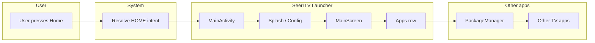

# SeerrTV as an Android TV Launcher: Analysis and Recommendations

## 1. Introduction / Executive Summary

This document analyzes what would be involved in offering **SeerrTV as an optional launcher** for Android TV—that is, a build that can replace the device home screen so users see SeerrTV content first when they press Home or turn on the TV.

**Scope:**

- **Optional launcher**: A separate build variant that acts as the home surface, while the existing SeerrTV app build remains unchanged as a normal TV app tile.
- **Technical feasibility**: What manifest and build changes are required.
- **Build strategy**: How to keep the current app as-is and add a launcher build from the same codebase.
- **Feature set**: What a fully functional TV launcher must support.
- **Gaps**: What SeerrTV would need to add or document to deliver a great launcher experience.

**Summary:** It is feasible to add a launcher build with minimal code duplication (manifest and build config only). The main new feature required is an **Apps** row or section so users can open other installed TV apps. Optional enhancements include TvProvider-based recommendations and clear documentation for setting the launcher as default on various devices.

---

## 2. Current State

**App today**

- SeerrTV uses a single `MainActivity` with intent filters `MAIN` and `LEANBACK_LAUNCHER` in [tv/src/main/AndroidManifest.xml](tv/src/main/AndroidManifest.xml). The app appears as a tile on the Android TV home screen and is launched like any other TV app. There is no `HOME` category, so it does not act as a launcher.

**Build configuration**

- Product flavors are defined in [tv/build.gradle.kts](tv/build.gradle.kts): dimension `distribution` with `play` and `direct`. Both use the same `applicationId` (`ca.devmesh.seerrtv`). There is no launcher-specific variant yet.

**Entry flow**

- Startup is handled in [MainActivity.kt](tv/src/main/java/ca/devmesh/seerrtv/MainActivity.kt): a NavHost with `startDestination = "splash"`. Flow is **Splash** → **Config** (if not configured) → **Main**. MainScreen shows category rows (Recently Added, Recent Requests, Trending, Popular Movies/Series, Genres, Studios, Networks, etc.) with D-pad navigation and a backdrop. Settings and configuration are available from the top bar.

---

## 3. What “Launcher” Means on Android TV

**Intent filters**

- To act as the **home** surface (what opens when the user presses Home or boots the device), the main activity must declare:
  - `android.intent.action.MAIN`
  - `android.intent.category.HOME`
  - `android.intent.category.DEFAULT`
- `LEANBACK_LAUNCHER` alone only makes the app a normal TV app tile; it does not make the app a launcher.

**User choice**

- On many Android TV devices, the system launcher is preferred. Users typically enable a custom launcher by:
  1. **Disabling the default launcher via ADB** (e.g. `adb shell pm disable-user --user 0 com.google.android.tvlauncher`), or
  2. **Using a launcher picker** if the OEM provides one (e.g. in Settings).
- There is no way to programmatically “set as default” without user or ADB action. Documentation and, optionally, an in-app “How to set as default” screen are important.

**References**

- [Channels on the home screen](https://developer.android.com/training/tv/discovery/recommendations-channel) (TvProvider, recommendations)
- Android TV launcher intent filter documentation (HOME + DEFAULT)

---

## 4. How to Keep the App As-Is and Add a Launcher Build

**Product flavor**

- Add a second flavor dimension, e.g. `mode`, with values `app` and `launcher`:
  - **app**: Current behavior; manifest has only `MAIN` + `LEANBACK_LAUNCHER`.
  - **launcher**: Same code and `MainActivity`, but a **launcher-specific manifest** (e.g. `tv/src/launcher/AndroidManifest.xml`) that adds `HOME` and `DEFAULT` to the same activity.
- Resulting build variants: `playApp`, `playLauncher`, `directApp`, `directLauncher` (or equivalent). No code duplication—only manifest and build config differ.

---

## 5. Features Required for a Fully Functional Launcher

| Feature | Status in SeerrTV | Notes |
|--------|--------------------|------|
| **Home surface** | ✅ Implemented | Launcher build opens on Home key; that “home” can be the existing MainScreen (categories + backdrop). |
| **App drawer / list of installed apps** | ✅ Implemented | Users expect to open other apps. Use `PackageManager.getLeanbackLaunchIntentForPackage()` (or query activities with `LEANBACK_LAUNCHER`) to list TV apps and launch them. This is the main **new** feature: an “Apps” row or section. |
| **Settings / configuration** | Present | Config and settings are available from the top bar / settings menu. |
| **Recommendations on system home** | Optional | For “Watch Next” or recommendations on the **system** home (when not replaced), use TvProvider (Android 8.0+, API 26): `PreviewProgram`, `WatchNextProgram`, channels. SeerrTV minSdk is 25; channel features apply only on API 26+. Optional for a launcher that fully replaces home. |
| **Back key on home** | Present | When the user is on the launcher “home” (MainScreen), Back is already handled (e.g. exit confirmation via D-pad/back handling). |
| **Startup performance** | To optimize | Launcher starts on boot and on Home press; cold start and first frame should be fast (minimal splash, defer heavy work where possible). |

---

## 6. Gaps to Fill for a Great Experience

**App discovery**

- ✅ **Done.** Apps row is implemented (see §10). Query uses `LEANBACK_LAUNCHER`; `<queries>` declared in [tv/src/main/AndroidManifest.xml](tv/src/main/AndroidManifest.xml) and [tv/src/launcher/AndroidManifest.xml](tv/src/launcher/AndroidManifest.xml) for Android 11+ package visibility.

**Default launcher setup**

- Document how to set SeerrTV Launcher as default: enable Developer options, use ADB to disable the default launcher (or point to OEM-specific steps). Consider a simple “How to set as default” screen in the launcher build.

**TvProvider integration (optional)**

- For “Continue Watching” or “Recently Added” on the **system** home row (when the system home is still used) or for a future hybrid experience: create a channel, add `PreviewProgram` / `WatchNextProgram`, request `WRITE_EPG_DATA`, handle `INITIALIZE_PROGRAMS` and program-removal intents. Requires permission and background sync with the Seerr API. Valuable for discovery even when the launcher replaces home.

**Launcher vs app in UI**

- ✅ **Done.** The launcher build shows a dedicated **Apps** row at the top of MainScreen (above category rows) so users can access other TV apps without leaving the launcher.

**Testing**

- Test “set as default” and Home key behavior on real devices from multiple OEMs; behavior can vary or be restricted.

---

## 7. Risks and Considerations

- **OEM variability**: Some devices do not allow changing the launcher or require ADB. Set user expectations and document device-specific notes.
- **Single applicationId**: If both the app and launcher use `ca.devmesh.seerrtv`, only one can be installed at a time. Use a launcher-specific `applicationId` (e.g. `ca.devmesh.seerrtv.launcher`) if you want both installable.
- **Store policy**: If distributing the launcher build on the Play Store, ensure compliance with TV app and any “home screen” or launcher policies.

---

## 8. Recommendations Summary

**Phase 1 (MVP launcher)**

- Add a launcher product flavor with `HOME` + `DEFAULT` in the manifest.
- Keep the existing MainScreen as the launcher home UI.
- Add an **Apps** row or section (PackageManager + leanback intents).
- Document ADB/default launcher setup (and optionally add an in-app “How to set as default” screen).
- Optionally use a separate `applicationId` for the launcher so the app and launcher can coexist.

**Phase 2 (optional)**

- TvProvider channels for recommendations / Watch Next, for devices that still show the system home or for a future “content on system home” experience.

**Phase 3 (polish)**

- Optimize cold start; optional “How to set as default” onboarding; device-specific notes in docs.

---

## 9. Flow Overview

The following diagram summarizes the launcher flow once the launcher build is installed and set as default:

- **User presses Home** → system resolves the HOME intent → **SeerrTV Launcher (MainActivity)** → Splash/Config or MainScreen. From MainScreen, the **Apps** row uses PackageManager to list and launch other TV apps.

---

## 10. Implementation Status (Apps Row and Reorder)

The following launcher-specific work has been implemented.

### 10.1 Apps row

- **UI:** [InstalledAppsRow.kt](tv/src/main/java/ca/devmesh/seerrtv/ui/InstalledAppsRow.kt) – horizontal row of app tiles (icon + label), D-pad focus, scale on selection. Shown only when `BuildConfig.IS_LAUNCHER_BUILD` is true.
- **Data:** [TvAppsHelper.kt](tv/src/main/java/ca/devmesh/seerrtv/util/TvAppsHelper.kt):
  - `getInstalledTvApps(context)` – queries `PackageManager` for activities with `ACTION_MAIN` + `LEANBACK_LAUNCHER`, excludes the current app, sorted by label.
  - `TvAppInfo` – packageName, label, icon, launchIntent.
- **Integration:** MainScreen (launcher build) holds `installedApps` (mutableStateListOf), filled in a `LaunchedEffect` via `getInstalledTvAppsWithSavedOrder`. Apps row is the first item in the main LazyColumn in [ScrollableCategoriesSection](tv/src/main/java/ca/devmesh/seerrtv/ui/MainScreen.kt). Enter on a focused app launches it via `startActivity(launchIntent)`.

### 10.2 Reorder mode

- **Entry:** Long-press Select/Enter (~1.2 s) while focus is on the Apps row. Handled in [DpadController.kt](tv/src/main/java/ca/devmesh/seerrtv/ui/focus/DpadController.kt): KeyDown sets pending enter state (only on first KeyDown to avoid key-repeat reset); KeyUp after ≥1200 ms calls `onEnterLongPress`. MainScreen sets `isReorderMode = true` and shows a toast (e.g. “Reorder: Left/Right to move, Enter or Back to save”).
- **Feedback:** Hold-to-reorder progress is shown on the **focused app tile** (linear progress bar at bottom of tile) so the user sees progress before release. Implemented via `onEnterLongPressProgress` callback (start/end) and `holdToReorderProgress` state in MainScreen; [ScreenDpadConfigs.kt](tv/src/main/java/ca/devmesh/seerrtv/ui/focus/ScreenDpadConfigs.kt) and DpadController wire the callback.
- **Interaction:** In reorder mode, Left/Right swap the focused app with the neighbor and update focus; order is saved after each move. Enter or Back exits reorder mode, shows “App order saved” toast, and clears `isReorderMode`.

### 10.3 Persistence

- **Storage:** SharedPreferences, file `app_row_order`, key `package_order`. Order is stored as a **single delimited string** (e.g. `pkg1|pkg2|pkg3`) so order is preserved (unlike `putStringSet`/`getStringSet`, which do not guarantee order).
- **API (TvAppsHelper):**
  - `loadAppRowOrder(context)` – returns `List<String>?` (package names in order), or null if none saved.
  - `saveAppRowOrder(context, packageNames)` – writes the list as a delimited string.
  - `applyAppRowOrder(fullList, savedOrder)` – returns a list with saved-order packages first (in order), then any packages from `fullList` not in saved order (e.g. newly installed apps) appended. Uninstalled packages in saved order are skipped.
  - `getInstalledTvAppsWithSavedOrder(context)` – gets installed TV apps, applies saved order, and **re-saves** if the effective list changed (e.g. an app was uninstalled or a new app was installed) so persisted state stays in sync.
- **When order is applied:** On initial load (LaunchedEffect), on refresh (Up from top bar → `onRefresh`), and when the app resumes (Lifecycle `ON_RESUME`). New apps appear at the end of the list; after the next load/save cycle they are persisted.

### 10.4 Package visibility

- **Manifest:** Both [tv/src/main/AndroidManifest.xml](tv/src/main/AndroidManifest.xml) and [tv/src/launcher/AndroidManifest.xml](tv/src/launcher/AndroidManifest.xml) declare `<queries>` with an `<intent>` for `ACTION_MAIN` + `LEANBACK_LAUNCHER` so `queryIntentActivities` works on Android 11+ without package visibility restrictions.

### 10.5 Running the launcher build

- **Build/install:** `./gradlew :tv:installPlayLauncherDebug`
- **Launch:** `adb shell am start -n ca.devmesh.seerrtv.launcher/ca.devmesh.seerrtv.MainActivity`
- See README Quick start for the same commands.

---

## References

- [Android TV: Create and run a TV app](https://developer.android.com/training/tv/get-started/create)
- [Channels on the home screen (TvProvider)](https://developer.android.com/training/tv/discovery/recommendations-channel)
- [Recommendations row (Android N and earlier)](https://developer.android.com/training/tv/discovery/recommendations-row)
- SeerrTV: [tv/src/main/AndroidManifest.xml](tv/src/main/AndroidManifest.xml), [tv/build.gradle.kts](tv/build.gradle.kts), [MainActivity.kt](tv/src/main/java/ca/devmesh/seerrtv/MainActivity.kt)
